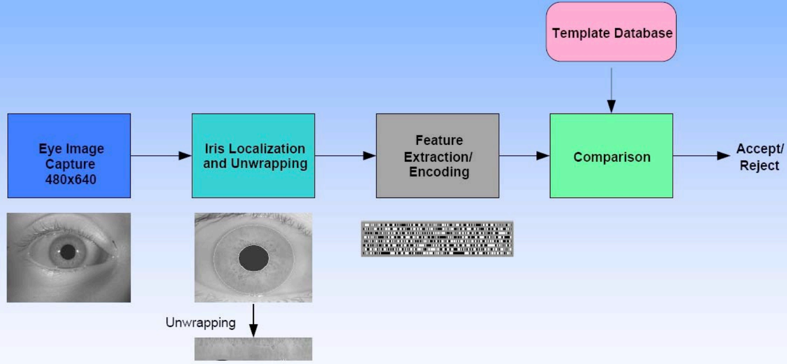

# Iris Recognition System

## Introduction
This project is an iris recognition system that uses the Daugman's Rubber Sheet Model to extract the iris features. 
The system is implemented in Python and uses OpenCV for image processing.

## Verification flow



## Dependencies
- Python 3.8
- OpenCV 3.4.2

## Usage
To run the system, execute the following command:
```
python iris_recognition.py
```

