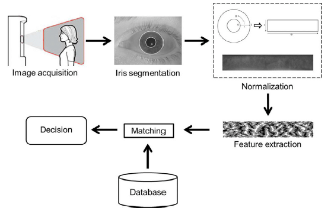

# Iris Recognition System

## Table of Contents

- [Introduction](#introduction)
- [Verification flow](#verification-flow)
- [Dependencies](#dependencies)
- [Usage](#usage)

## Introduction

This project is an iris recognition system that uses the Daugman's Rubber Sheet Model to extract the iris features.
The system is implemented in Python and uses OpenCV for image processing.

## Verification flow



## Dependencies

The project dependencies are listed in the requirements.txt file.
To install the dependencies, run the following command:

```bash
  pip install -r requirements.txt
```

To add file to package dependencies, run the following command:

```bash
  pip freeze > requirements.txt
```

Please create .env file in the root directory and fill the environment variables listed on the template

## Usage

To run the system, execute the following command:

```bash
    python iris_recognition.py
```

